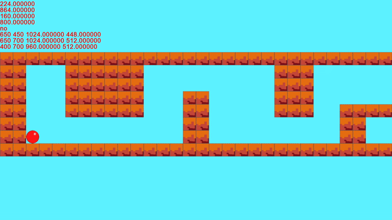

# Bounce Game

## 🎮 Об проекте

Я занимался этим проектом неделю, с 01.01.25 по 07.01.25. За это время я успел переписать коллизию несколько раз — от самой примитивной до более-менее адекватной.
Правда, «адекватной» — это, конечно, громко. Коллизия написана криво, и более-менее хорошо работает только в левом верхнем углу. Я уже знаю, как написать её лучше, но пока что занимаюсь изучением геометрии за 7–8 класс, чтобы всё было красиво.

Когда я разрабатывал этот проект, я не знал ничего про GitHub и про то, что можно как-то красиво и удобно организовать код и каталог с проектом. Поэтому можно видеть кучу комментариев в main — это мои коммиты)

---
